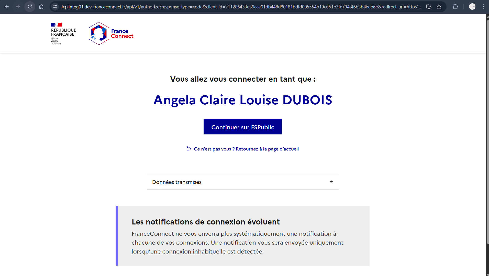

# 🎬 My Watch List
Application Django permettant de gérer une watchlist personnalisée, d’ajouter automatiquement des séries depuis l’API TMDB, et d’utiliser plusieurs méthodes d’authentification (interne, FranceConnect, Google OAuth2).

---

## 📌 Fonctionnalités

### 🟦 Partie 1 — To‑Do List (héritée du projet initial)
- Création, mise à jour et suppression de tâches
- Interface simple et fonctionnelle
- Base du projet Django fournie dans l’exercice

---

### 🟩 Partie 2 — Watchlist avec TMDB (Fournisseur de données)
- Intégration complète de l’API **TMDB (Discover TV)**
- Ajout automatique de séries selon le fournisseur :
  - 🔴 Netflix
  - 🔵 Prime Video
  - 🟣 Apple TV
- Chaque clic ajoute **10 nouvelles séries différentes**
- Gestion stricte des doublons via `tmdb_id`
- Stockage du poster (`poster_path`) pour affichage dans l’UI
- Interface moderne pastel inspirée de Netflix

---

### 🟧 Partie 3 — Authentification interne (Fournisseur d’identité interne)
- Création de compte
- Connexion / déconnexion
- Protection des pages via `@login_required`
- Chaque utilisateur voit **uniquement sa propre watchlist**

---

### 🟦 Partie 4 — Authentification FranceConnect (v1)
- Intégration complète du flux OAuth2 FranceConnect :
  - Redirection vers FC
  - Récupération du `code`
  - Échange contre un `access_token`
  - Appel à `/userinfo`
- Création automatique du compte si l’utilisateur n’existe pas
- Connexion automatique après authentification
- Gestion du `state` et du `nonce` pour la sécurité
- Déconnexion FranceConnect via `/logout`

---

### 🟨 Partie 5 — Authentification Google OAuth2 (Exercice 7)
- Intégration du flux OAuth2 Google :
  - Redirection vers Google
  - Échange du code contre un token
  - Récupération des infos utilisateur
- Création automatique du compte (`google_<sub>`)
- Connexion automatique
- Bouton “Se connecter avec Google” dans la page de login

---

## 🛠️ Technologies utilisées
- **Python 3**
- **Django 5**
- **Bootstrap 4**
- **API TMDB**
- **FranceConnect v1**
- **Google OAuth2**
- **SQLite** (par défaut)

---

## 🚀 Installation & lancement

### 1. Cloner le projet
```bash
git clone https://github.com/<ton-nom>/my-watch-list.git
cd my-watch-list

## 📸 Aperçu de l’interface



---

## 🎥 Rendus demandés

### 📝 Rendu 1
- Dépôt du code sur GitHub
- Vidéo démonstrative déposée dans une issue nommée **“Rendu 1”**

### 📝 Rendu 2
- Dépôt du code final sur GitHub
- Vidéo démonstrative déposée dans une issue nommée **“Rendu 2”**

---

## 👤 Auteur
Projet réalisé par **Syntiche Attoh**
Master 2 — ESIEE IT
Module : *Architecture logicielle, API et interopérabilité*
