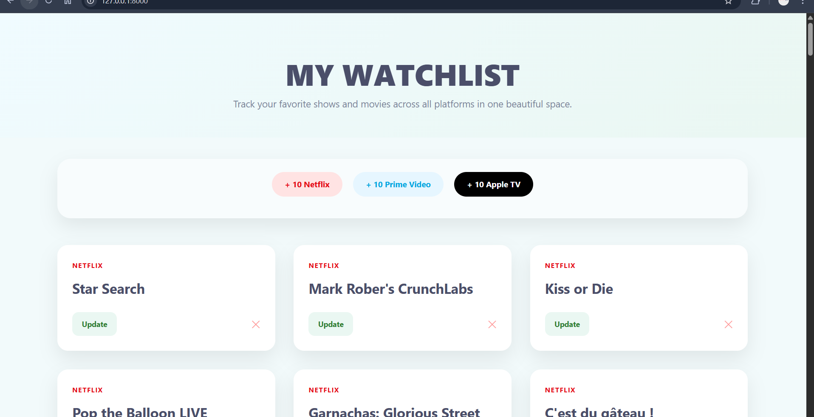

# TMDB API – Tests (Exercice 2)

Ce dossier contient l’ensemble des requêtes utilisées pour l’Exercice 2 du TP
« Intégration API – Fournisseur de données ».

Les requêtes ont été créées et testées avec Postman, puis exportées sous forme
de collection (`tmdb-collection.json`).

## 📌 Requêtes incluses

La collection contient 4 appels à l’API TMDB (endpoint *Discover TV*) :

1. **10 séries du genre Action & Adventure**
   - Paramètre : `with_genres=10759`

2. **10 séries les mieux notées disponibles sur Netflix**
   - Paramètre : `with_watch_providers=8`
   - Région : `watch_region=FR`

3. **10 séries les mieux notées disponibles sur Amazon Prime Video**
   - Paramètre : `with_watch_providers=119`
   - Région : `watch_region=FR`

4. **10 séries les mieux notées disponibles sur Apple TV+**
   - Paramètre : `with_watch_providers=350`
   - Région : `watch_region=FR`

## 🔐 Authentification

Toutes les requêtes utilisent le **Bearer Token (API Read Access Token v4)** fourni par TMDB :

